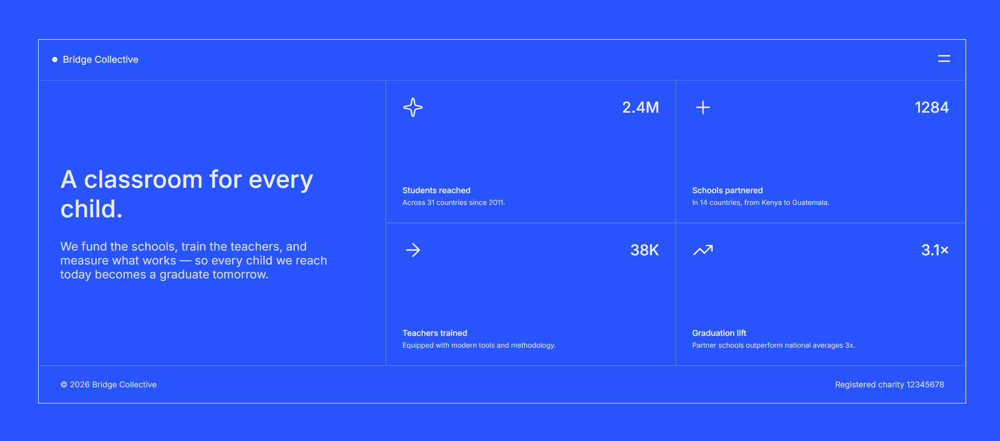

# Frontend Mentor - Grid Landing Page

A responsive landing page built as a solution to the
[Grid Landing Page challenge on Frontend Mentor](https://www.frontendmentor.io/challenges/grid-landing-page).

## Overview

### The challenge

Users should be able to:

- View the optimal layout for the page depending on their device's screen size
- See hover states for interactive elements
- Open and close the navigation menu at any screen size

### Screenshot

### Links

- GitHub Repository: https://github.com/MrAdarshPathak-dev/frontend-mentor-grid-landing-page
- Live Site:  https://mradarshpathak-dev.github.io/frontend-mentor-grid-landing-page/

## My Process

### Built With

- Semantic HTML5
- CSS3
- CSS Grid
- Flexbox
- Responsive design
- CSS `:target` for the navigation menu

### What I Learned

This project helped me practice CSS Grid and responsive layouts.

I learned how to:

- Create a multi-column layout using CSS Grid
- Make the layout responsive using media queries
- Create a 2x2 statistics grid
- Use Flexbox for navigation and content alignment
- Create a toggleable navigation menu using the CSS `:target` pseudo-class
- Use hover states to improve interactive elements
- Structure a page using semantic HTML elements

### Continued Development

In future projects, I want to improve:

- JavaScript-based navigation and interactions
- Accessibility
- Responsive typography
- Advanced CSS Grid layouts
- Component-based development with JavaScript and React

### AI Collaboration

Used AI as a learning and debugging assistant to understand CSS concepts
and properties when needed. The project implementation and final testing
were done by me.

## Author

- GitHub: [@MrAdarshPathak-dev](https://github.com/MrAdarshPathak-dev)
- Frontend Mentor:https://www.frontendmentor.io/profile/MrAdarshPathak-dev

## Acknowledgments

Thanks to [Frontend Mentor](https://www.frontendmentor.io/) for providing the challenge and design resources.
